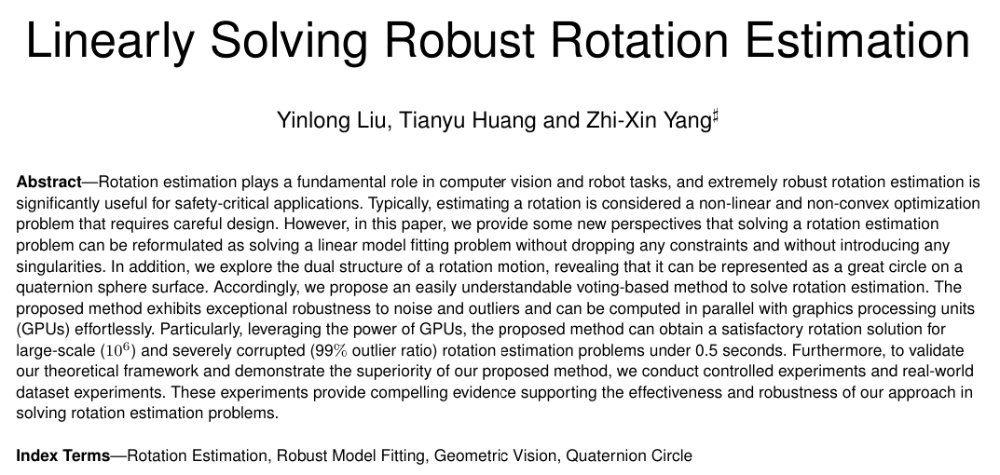
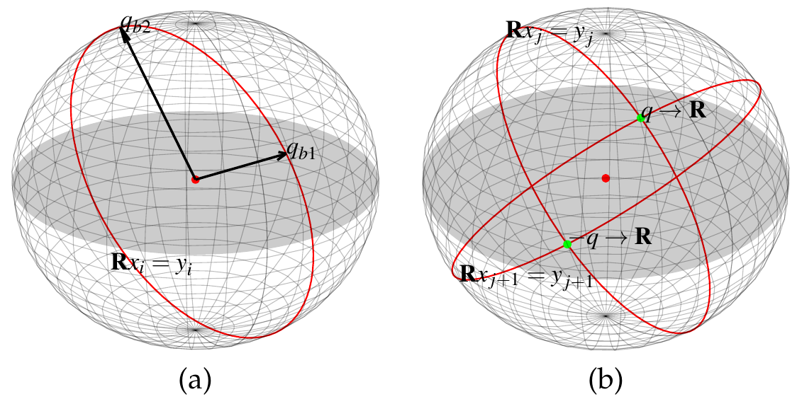
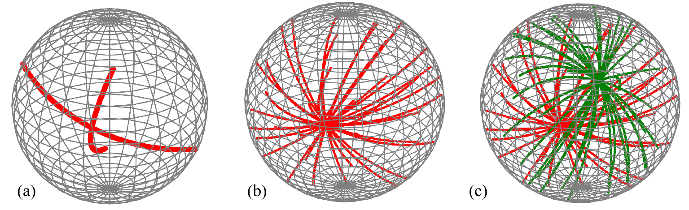
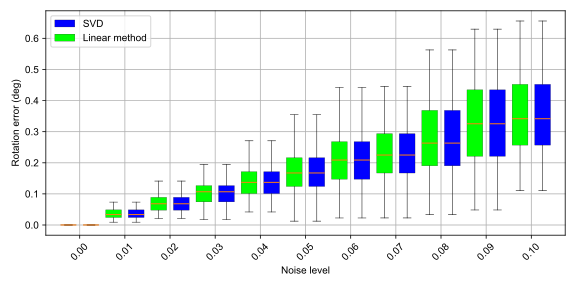
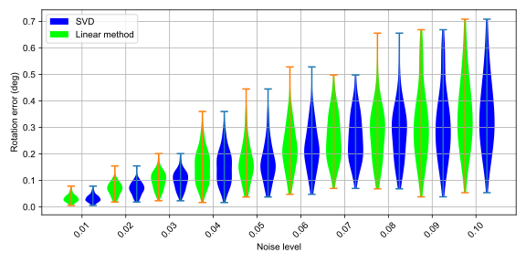
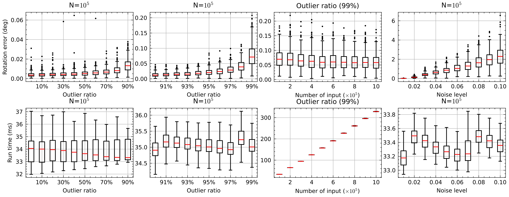
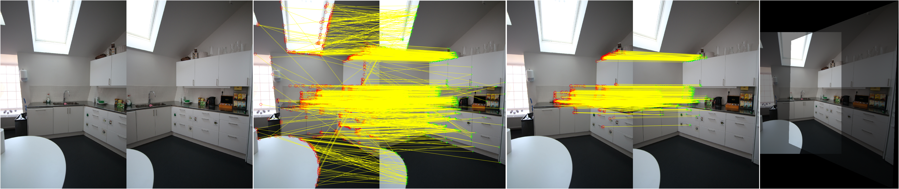
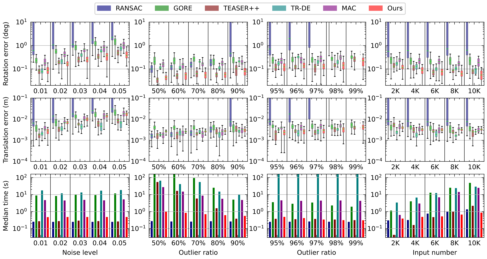
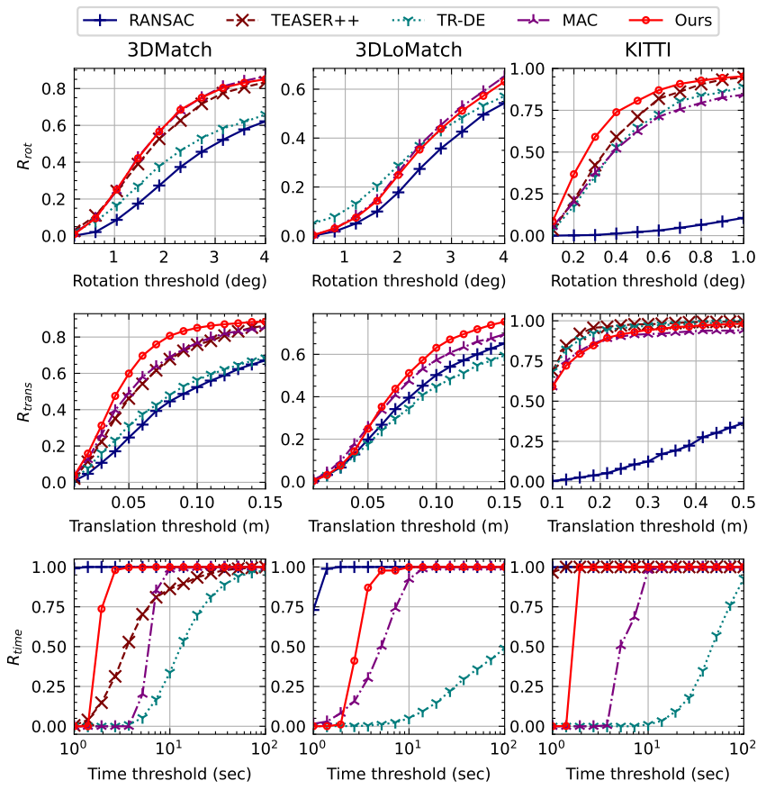
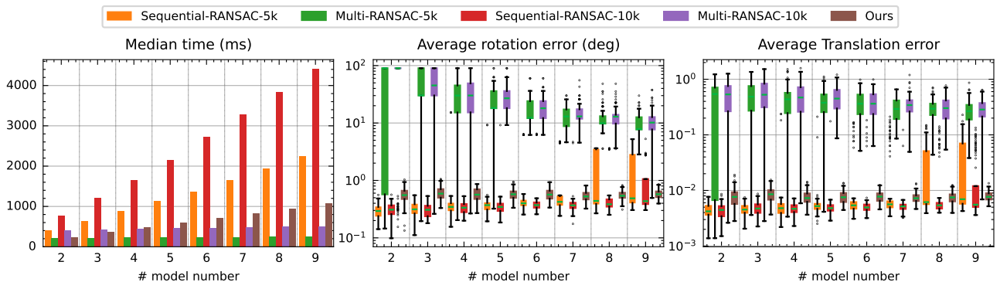

This is the code to verify the feasibility of the quaternion circle, which is realted to the paper
      
      Yinlong Liu, Tianyu Huang, and, Zhi-Xin Yang, "Linearly Solving Robust Rotation Estimation".
***

  

## Quaternion Circle ⚛

The visualization of quaternion circle. （For better understanding, the quaternion circles were illustrated in $\mathbb{R}^3$.）

  

 (a) Given $\mathbf{R}{x}_i={y}_i$, the solution of $\mathbf{R}$ must be in a great circle (one-dimensional structure) in the unit quaternion sphere. (b) Given two different input observations, $\mathbf{R}$ can be solved. Geometrically, the to-be-solved rotation is the intersections of two quaternion circles, which are obtained from the input observations. Specifically, there are two symmetrical intersecting points in the unit quaternion sphere surface, i.e., ${q}$ and $-{q}$. They are however corresponding to the same rotation.

      
# Code 👨‍💻

      > 1. compare_with_svd.py **includes the least squared method**

      > 2. rot_voting_numpy.py **rotation voting by numpy (not optimized, for display purposes only)**

      > 3. rot_voting_cupy.py **rotation voting with GPU**

      > 4. quaternion_circle_show **Visualization of quaternion circles in 3D space**

Note it is better to run the code with a GPU with >16G VRAM.
***

# More Details 🚩
"*In mathematics, a stereographic projection is a perspective projection of the sphere, through a specific point on the sphere (the pole or center of projection), onto a plane (the projection plane) perpendicular to the diameter through the point. It is a smooth, bijective function from the entire sphere except the center of projection to the entire plane. It maps circles on the sphere to circles or lines on the plane, and is conformal, meaning that it preserves angles at which curves meet and thus locally approximately preserves shapes. It is neither isometric (distance preserving) nor equiareal (area preserving).*" **----From [WiKi](https://en.wikipedia.org/wiki/Stereographic_projection)**. 

There is a wonderful video to demastrate the stereographic pojection <https://youtu.be/l3nlXJHD714>.
### Two quaternion cicles shown in $\mathbb{R}^3$ after stereographic pojection from $\mathbb{S}^3$

  

Note that "**It maps circles on the sphere to circles or lines on the plane**". It means the **quaternion circle**, which is a great cirlce in $\mathbb{S}^3$ should be a cirlce or a line in $\mathbb{R}^3$ after stereographic pojection.  

- (a) Given two different rotation constraints, i.e., $\mathbf{R}{x}_i={y}_i$, there will be two quaternion circles in $\mathbb{S}^3$. The solution that can meet the two different rotation constraints will be the intersection points of two great circles. Accordingly, the intersection point will be projected into $\mathbb{R}^3$.
- (b) If there are many different rotation constraints and they all obey the same rotation motion, the corresponding quaternion circles should meet at one intersection point.
- (c) **Multiple rotation motions** Naturally, if there are two different rotation motions in the scenes, there will be two intersection points in the projected space.

***
# Experimnets
## Comparing with SVD method 

  

  

## Synthetic Controlled Experiments

## Panorama Stitching

## Synthetic Controlled 6DoF Experiments

## 6DoF Real-World Experiments

  

## Multiple Rotation Estimation

  

***
### Author
Copyright @ YinlongLiu(AT)outlook.com

